# Project 1: Sensitivity Analysis

**Math 540: Uncertainty Quantification**

**Author:** Tilekbek Zhoroev

---

## Problem 1: Spring Model Sensitivities

### Problem Statement

Consider the spring model

$$\frac{d^2 z}{dt^2} + C\frac{dz}{dt} + Kz = 0$$

with initial conditions

$$z(0) = 2, \quad \frac{dz}{dt}(0) = -C$$

and inputs $\Theta = [K, C]$. Use the complex-step approximation to compute the sensitivities $\frac{\partial z}{\partial K}$ and $\frac{\partial z}{\partial C}$ for $K = 20.5$ and $C = 1.5$ and compare with finite-difference approximations and the analytic values.

### Analytical Solution

The textbook provides the analytic solution of the spring model as

$$y(t) = 2e^{-Ct/2} \cos\left(\sqrt{K - C^2/4} \cdot t\right)$$

when $C^2 - 4K < 0$.

### Local Sensitivities

The local sensitivities are derived analytically:

$$\frac{dy}{dK} = e^{-Ct/2} \cdot \frac{-2t}{\sqrt{4K - C^2}} \sin\left(\sqrt{K - C^2/4} \cdot t\right)$$

$$\frac{dy}{dC} = e^{-Ct/2} \left[\frac{Ct}{\sqrt{4K - C^2}} \sin\left(\sqrt{K - C^2/4} \cdot t\right) - t\cos\left(\sqrt{K - C^2/4} \cdot t\right)\right]$$

### Numerical Approximation Methods

**Finite Difference Approximation:**

$$f'(x) \approx \frac{f(x + h) - f(x)}{h}$$

We use step size $h = 10^{-8}$ for the finite difference approximation.

**Complex-Step Approximation:**

$$f'(x) \approx \frac{\text{Im}(f(x + ih))}{h}$$

We use step size $h = 10^{-16}$ for the complex-step approximation. This method achieves machine precision without subtractive cancellation errors.

### Results

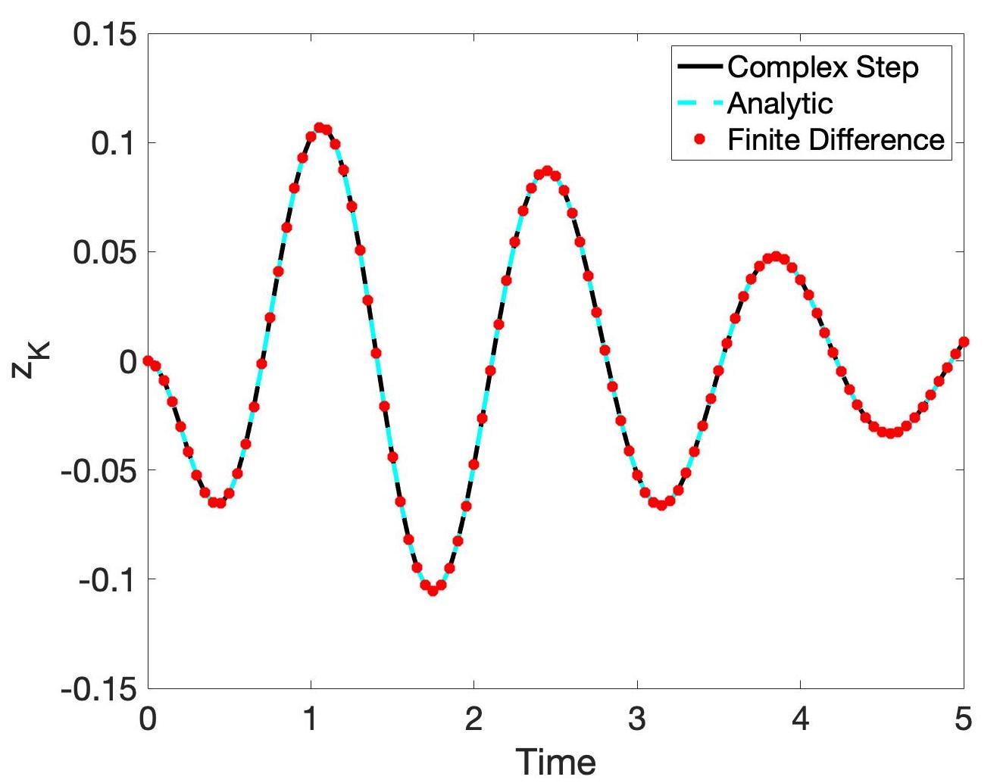

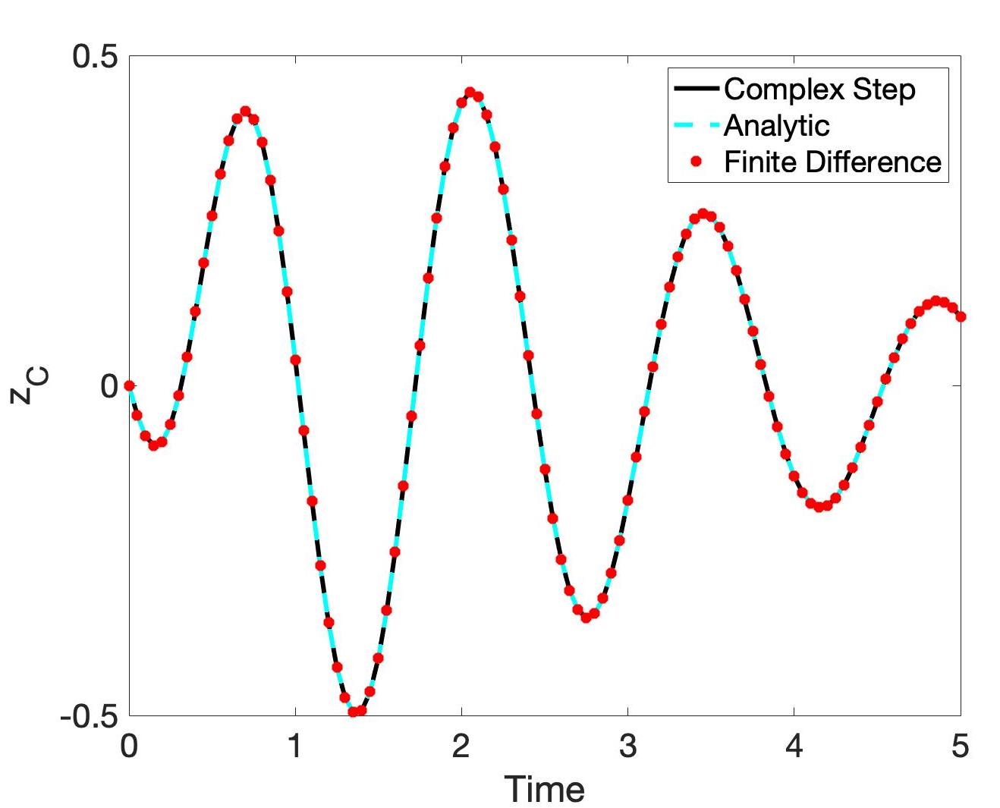

**Figure 1:** Comparison of complex-step and finite difference approximations with analytic differentiation: (a) $\frac{\partial z}{\partial K}$; (b) $\frac{\partial z}{\partial C}$.

We observe that both approximations match the analytical solution well. The complex-step method achieves higher accuracy due to the absence of subtractive cancellation.

---

## Problem 2: SIR Model Parameter Subset Selection

### Problem Statement

Apply the Parameter Subset Selection to the 4-parameter SIR model:

$$\frac{dS}{dt} = \delta N - \delta S - \gamma k I S, \quad S(0) = S_0$$

$$\frac{dI}{dt} = \gamma k I S - (r + \delta)I, \quad I(0) = I_0$$

$$\frac{dR}{dt} = rI - \delta R, \quad R(0) = R_0$$

with initial conditions $S_0 = 900$, $R_0 = 0$, $I_0 = 100$ so $N = 1000$. Take the recovered individuals $R(t_i)$ as the response, where $t_i \in [0, 5]$ are 50 equally-spaced time values. Using nominal values $[0.2, 0.1, 0.15, 0.6]$ for parameters $\Theta = [\gamma, k, \delta, r]$, determine an identifiable parameter set.

### Sensitivity Equations

Since we don't know the analytic solution, we derive the sensitivity equations. Define the sensitivity vector:

$$\mathbf{s}(t) = \left[\frac{\partial S}{\partial \gamma}, \frac{\partial I}{\partial \gamma}, \frac{\partial R}{\partial \gamma}, \ldots, \frac{\partial S}{\partial r}, \frac{\partial I}{\partial r}, \frac{\partial R}{\partial r}\right]^\top$$

The Jacobian matrix of the system is:

$$J = \begin{bmatrix} -\delta - \gamma k I & -\gamma k S & 0 \\ \gamma k I & \gamma k S - (r + \delta) & 0 \\ 0 & r & -\delta \end{bmatrix}$$

The sensitivity equations are:

$$\frac{d\mathbf{s}(t)}{dt} = \frac{\partial g}{\partial u}\mathbf{s}(t) + \frac{\partial g}{\partial \alpha}$$

with initial condition $\mathbf{s}(0) = \mathbf{0}_{12}$.

The block diagonal structure is:

$$\frac{\partial g}{\partial u} = \text{diag}(J, J, J, J)$$

And the forcing term contains derivatives with respect to parameters:

$$\frac{\partial g}{\partial \alpha} = [-kIS, kIS, 0, -\gamma IS, \gamma IS, 0, N-S, -I, -R, 0, -I, I]^\top$$

### Verification with Complex-Step

We verify the sensitivity equations by comparing with complex-step approximations.

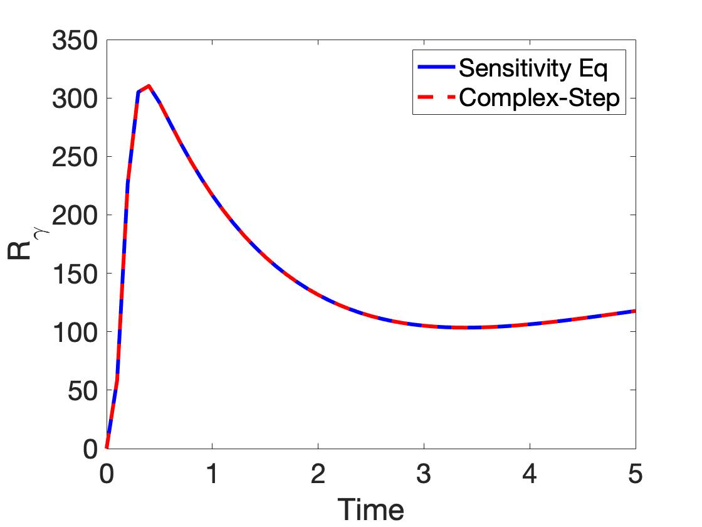

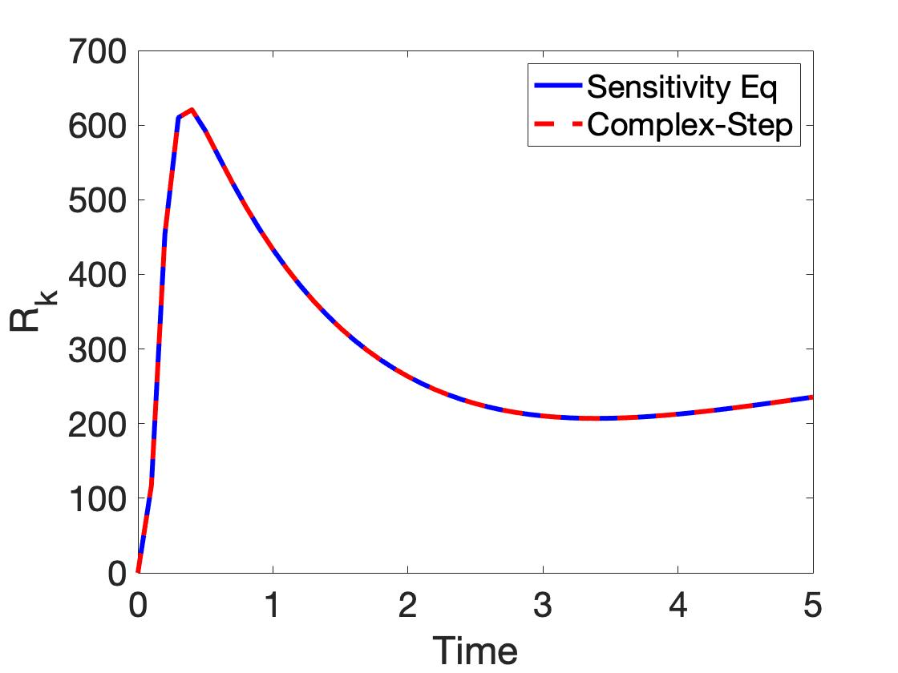

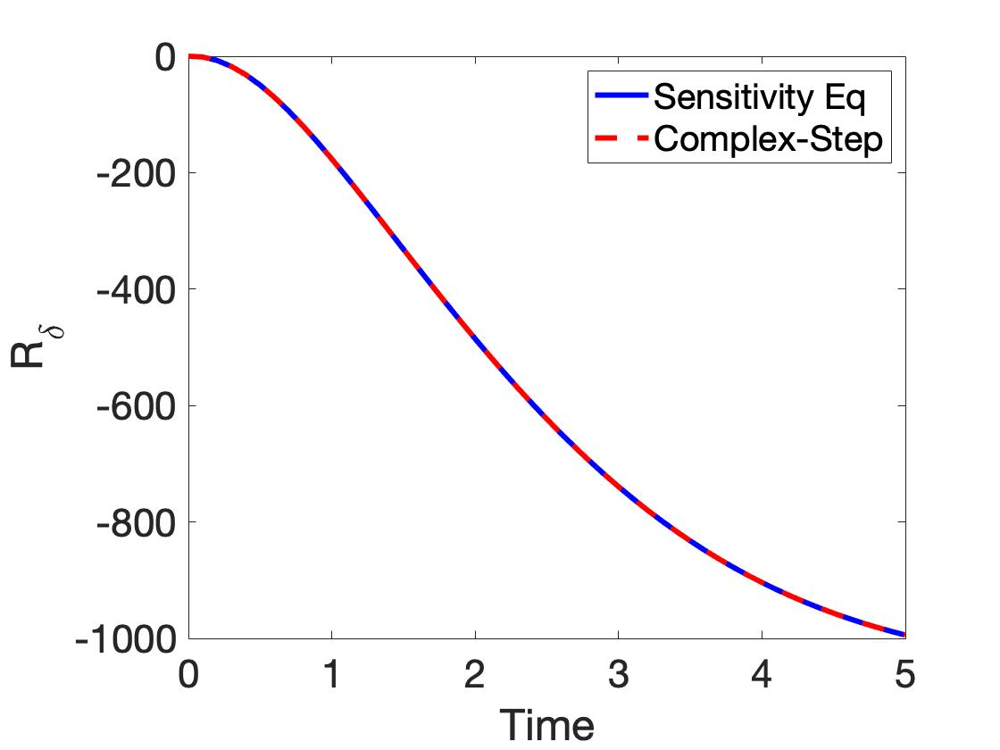

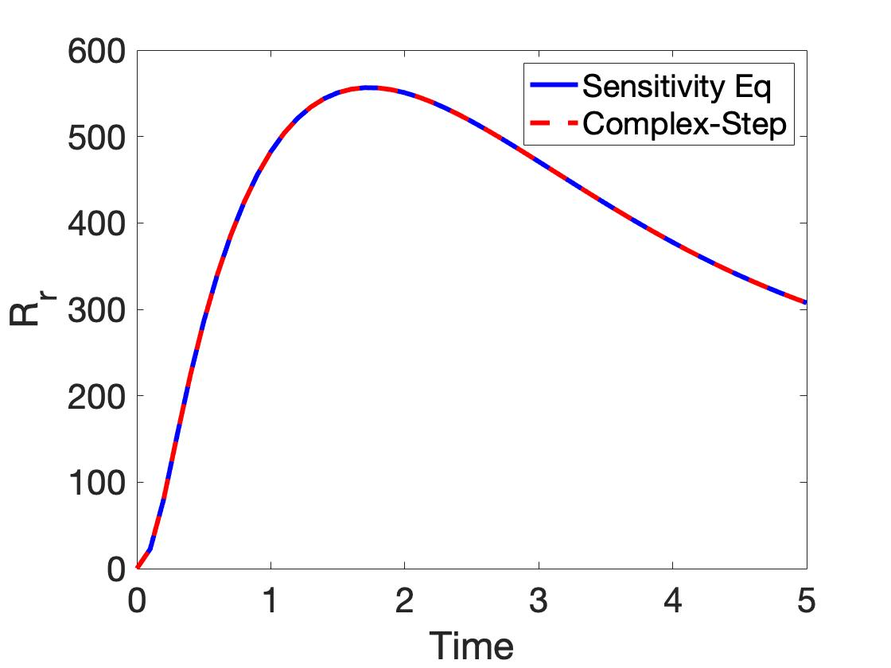

**Figure 2:** Sensitivity equations compared with complex-step approximations: (a) $\frac{\partial R(t)}{\partial \gamma}$; (b) $\frac{\partial R(t)}{\partial k}$; (c) $\frac{\partial R(t)}{\partial \delta}$; (d) $\frac{\partial R(t)}{\partial r}$.

### Sensitivity Matrix Construction

The sensitivity matrix is constructed as:

$$S_{ij} = \frac{\partial R(t_i)}{\partial \Theta_j}$$

for $i = 1, \ldots, 50$ time points and $j = 1, \ldots, 4$ parameters.

### Parameter Subset Selection Results

| $\eta$ | Identifiable Parameters | Non-identifiable Parameters |
|--------|------------------------|----------------------------|
| $10^{-4}$ | $\{k, \delta, r\}$ | $\{\gamma\}$ |
| $10^{-6}$ | $\{k, \delta, r\}$ | $\{\gamma\}$ |
| $10^{-8}$ | $\{k, \delta, r\}$ | $\{\gamma\}$ |
| $10^{-10}$ | $\{\gamma, k, \delta, r\}$ | $\emptyset$ |

**Table 1:** Parameter Subset Selection results of SIR model.

---

## Problem 3: Heat Equation Parameter Identifiability

### Problem Statement

Consider the steady-state heat equation for an uninsulated rod:

$$\frac{d^2 T_s(x)}{dx^2} = \frac{2(a+b)h}{kab}[T_s(x) - T_{amb}], \quad 0 < x < L$$

with boundary conditions:

$$\frac{dT_s}{dx}(0) = \frac{\Phi}{k}, \quad \frac{dT_s}{dx}(L) = \frac{h}{k}[T_{amb} - T_s(L)]$$

where $T_s(x)$ is the steady-state temperature, $\Phi$ is the source heat flux at $x=0$, and $T_{amb}$ is the ambient temperature. The model parameters are $\Theta = [\Phi, h, k]$.

### Analytical Solution

The analytical solution is:

$$f(x, \Theta) = T_s(x, \Theta) = c_1(\Theta)e^{-\gamma x} + c_2(\Theta)e^{\gamma x} + T_{amb}$$

where:

$$\gamma = \sqrt{\frac{2(a+b)h}{abk}}$$

$$c_1(\Theta) = -\frac{\Phi}{k\gamma} \cdot \frac{e^{\gamma L}(h + k\gamma)}{e^{-\gamma L}(h - k\gamma) + e^{\gamma L}(h + k\gamma)}$$

$$c_2(\Theta) = \frac{\Phi}{k\gamma} + c_1(\Theta)$$

### Physical Parameters

- Ambient temperature: $T_{amb} = 21.29°C$
- Cross-sectional dimensions: $a = b = 0.95$ cm
- Rod length: $L = 70$ cm
- Nominal values: $k = 2.37$, $h = 0.00191$, $\Phi = -18.4$

### Part (a): Sensitivity Approximations

Using finite-differences and complex-step derivative approximations, we compute the sensitivities $\frac{\partial f}{\partial \Phi}$, $\frac{\partial f}{\partial h}$, and $\frac{\partial f}{\partial k}$ at 15 equally spaced spatial locations: $x_i = x_0 + (i-1)\Delta x$, where $x_0 = 10$ cm and $\Delta x = 4$ cm.

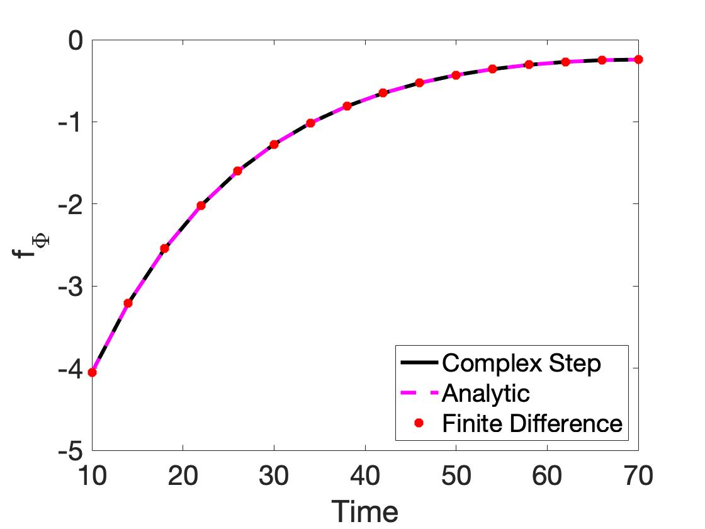

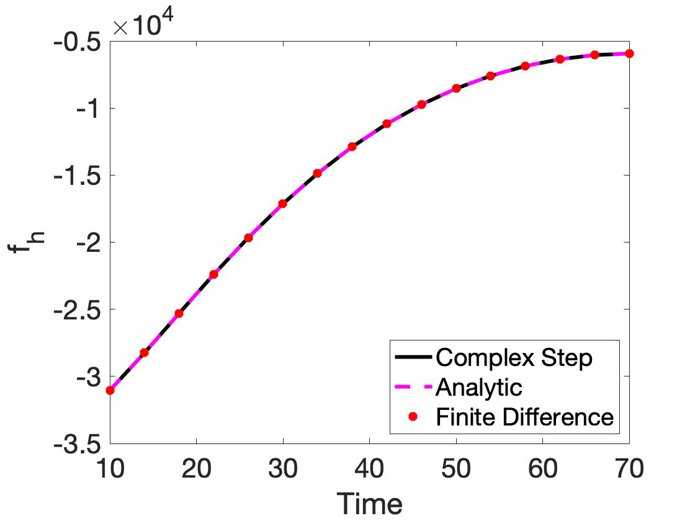

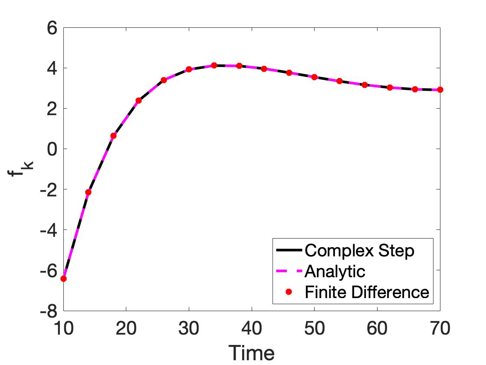

**Figure 3:** Comparison of complex-step and finite difference approximations with analytic differentiation: (a) $\frac{\partial f}{\partial \Phi}$; (b) $\frac{\partial f}{\partial h}$; (c) $\frac{\partial f}{\partial k}$.

### Part (b): Fisher Information Matrix Analysis

For parameters $\Theta = [\Phi, h, k]$, we construct the sensitivity matrix $S_{ij} = \frac{\partial f}{\partial \Theta_j}(x_i, \Theta)$ and the scaled Fisher information matrix $F = S^\top S$.

**Singular values of $S$:**

$$\sigma = [6.6945 \times 10^4, \; 1.3758 \times 10^1, \; 2.8262 \times 10^{-13}]$$

**Eigenvalues of $F$:**

$$\lambda = [4.4817 \times 10^9, \; 1.8927 \times 10^2, \; 3.5947 \times 10^{-14}]$$

One eigenvalue is near zero, indicating a non-identifiable direction. The eigenvector corresponding to the smallest eigenvalue is:

$$\mathbf{v} = [9.9181 \times 10^{-1}, \; -1.0295 \times 10^{-4}, \; -1.2775 \times 10^{-1}]^\top$$

This indicates that $\Phi$ is the non-identifiable parameter. This is consistent with the model parameterization since parameters appear as ratios $\frac{\Phi}{k}$ or $\frac{h}{k}$. We can identify the ratios uniquely but not the individual parameters simultaneously.

### Part (c): Reduced Parameter Set

Fixing $k$ at its known value and analyzing $\Theta = [\Phi, h]$:

**Singular values of $S$:** $\sigma = [6.6945 \times 10^4, \; 1.7575]$

**Eigenvalues of $F$:** $\lambda = [4.4817 \times 10^9, \; 3.0888]$

Since both eigenvalues are bounded away from zero, both parameters $\Phi$ and $h$ are identifiable when $k$ is fixed.

---

## Problem 4: Global Sensitivity Analysis of Helmholtz Energy

### Problem Statement

Consider the Helmholtz energy:

$$\psi(P, \theta) = \alpha_1 P^2 + \alpha_{11} P^4 + \alpha_{111} P^6$$

where $P$ is the polarization and $\theta = [\alpha_1, \alpha_{11}, \alpha_{111}]$ are parameters with nominal values $\alpha_1 = -389.4$, $\alpha_{11} = 761.3$, $\alpha_{111} = 61.5$.

### Part (a): Double-Well Behavior

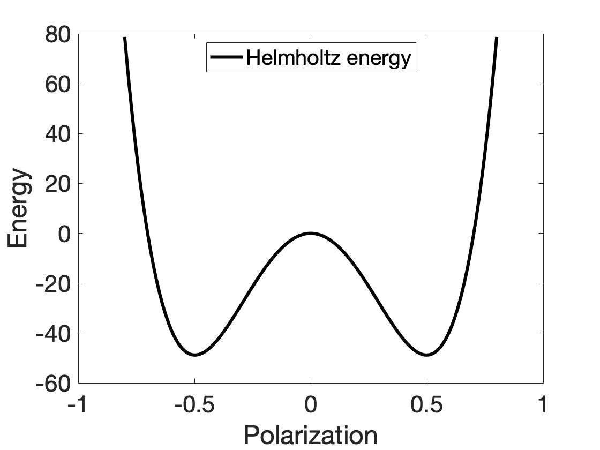

**Figure 4:** The graph of the Helmholtz energy for $P \in [-0.8, 0.8]$.

The double-well behavior is clearly observed, characteristic of ferroelectric materials.

### Part (b): Sensitivity Matrix and Identifiability

The sensitivity matrix is computed analytically:

$$S = \left[\frac{\partial \psi}{\partial \alpha_1}, \frac{\partial \psi}{\partial \alpha_{11}}, \frac{\partial \psi}{\partial \alpha_{111}}\right] = [P^2, P^4, P^6]$$

Using 17 equally spaced polarization values in $[0, 0.8]$:

**Eigenvalues of $F = S^\top S$:** $\lambda = \{0.0004, \; 0.0425, \; 1.9934\}$

If we take $\eta < 0.0004$, all parameters are identifiable. The eigenvector corresponding to the smallest eigenvalue is:

$$\mathbf{v} = [-0.1249, \; 0.6519, \; -0.7479]^\top$$

This indicates that $\alpha_{111}$ is the least identifiable parameter.

### Part (c): Morris Screening

The scalar response is computed analytically:

$$y(\theta) = \int_0^{0.8} \psi(P, \theta) \, dP = \alpha_1 \frac{(0.8)^3}{3} + \alpha_{11} \frac{(0.8)^5}{5} + \alpha_{111} \frac{(0.8)^7}{7}$$

Using Morris screening with forward differences, $r = 50$, $\Delta = 1/20$:

$$\mu^* = [0.1707, \; 0.0655, \; 0.03]$$

$$\sigma^2 = [0.1244 \times 10^{-25}, \; 0.0778 \times 10^{-25}, \; 0.0012 \times 10^{-25}]$$

Verification:

$$\mu^* \approx \left[\frac{(0.8)^3}{3}, \frac{(0.8)^5}{5}, \frac{(0.8)^7}{7}\right] = \left[\frac{\partial y}{\partial \alpha_1}, \frac{\partial y}{\partial \alpha_{11}}, \frac{\partial y}{\partial \alpha_{111}}\right]$$

The parameter $\alpha_{111}$ is least influential, consistent with Part (b).

### Part (d): Sobol Sensitivity Indices

Using the Saltelli Algorithm with $M = 10^4$:

**First-order indices:** $S = [0.6384, \; 0.3598, \; 4.2568 \times 10^{-4}]$

**Total-effect indices:** $S_T = [0.6395, \; 0.3606, \; 4.9117 \times 10^{-4}]$

Verification: $S_1 + S_2 + S_3 = 0.9987 \approx 1$

This indicates that higher-order interactions $S_{ij}$ are negligible, which is expected for a linearly parameterized model.

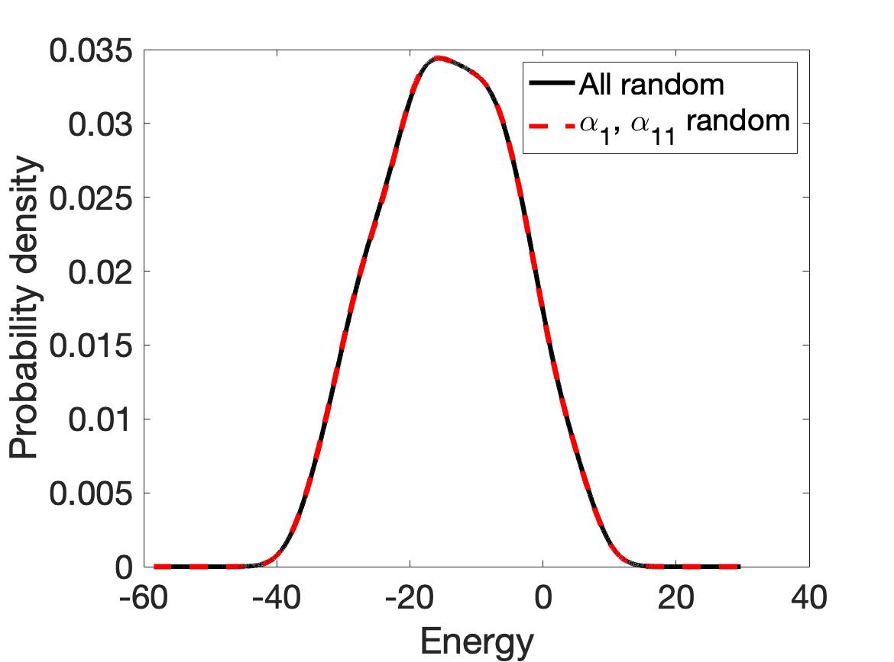

**Figure 5:** Distributions of $y$ for all random parameters (blue) and with non-influential parameter fixed (red).

Both PDFs are similar, confirming that fixing $\alpha_{111}$ has minimal effect on output uncertainty.

---

## Code Files

| File | Description |
|------|-------------|
| UQ_8_5.m / UQ_8_5.py | Spring model sensitivities |
| UQ_8_8.m / UQ_8_8.py | SIR model parameter subset selection |
| UQ_8_9.m / UQ_8_9.py | Heat equation identifiability |
| UQ_9_6.m / UQ_9_6.py | Global sensitivity analysis |

## References

1. Smith, R.C. (2013). *Uncertainty Quantification: Theory, Implementation, and Applications*. SIAM.
2. Saltelli, A. et al. (2008). *Global Sensitivity Analysis: The Primer*. Wiley.
