# Project 3: Bayesian Inference and MCMC

**Math 540: Uncertainty Quantification**

**Author:** Tilekbek Zhoroev

---

## Problem 1: Heat Model Bayesian Inference (Copper Rod)

### Problem Statement

Use the MATLAB code to repeat the analysis in Example 12.17 for the copper rod data. Use $k = 4.01$ for the thermal conductivity and $u_{amb} = 22.28$. Compare the chains and marginal distributions computed using the Metropolis Algorithm 12.9 with those generated by DRAM. Compare your results with the frequentist estimates from Project 2.

### Solution

From the previous project, we obtained optimal parameter values using the Frequentist approach. To apply the Metropolis Algorithm, we use the covariance matrix:

$$V = \begin{bmatrix} 0.0090 & -1.2117 \times 10^{-6} \\ -1.2117 \times 10^{-6} & 1.7726 \times 10^{-10} \end{bmatrix}$$

As described in Metropolis Algorithm 12.9, we use $R = \text{chol}(V)$ to define the proposal distribution. For faster convergence, we initialize with the OLS optimal parameters: $\Phi = -9.9265$ and $h = 0.0014$.

### MCMC Results

The acceptance probability for the Metropolis algorithm is:

$$P(\text{accept } \theta^*) = 0.2701$$

### DRAM Results

The chain covariance matrix using DRAM algorithm is:

$$V = \begin{bmatrix} 0.01127 & -1.5201 \times 10^{-6} \\ -1.5201 \times 10^{-6} & 2.2261 \times 10^{-10} \end{bmatrix}$$

This is very close to the initial (Frequentist) covariance matrix.

### Comparison of Methods

| Method | $h$ | $\Phi$ | $\sigma$ | $\sigma_h$ | $\sigma_\Phi$ |
|--------|-----|--------|----------|------------|---------------|
| OLS | 0.0014 | -9.9265 | 0.2301 | 0.0947 | $1.3314 \times 10^{-5}$ |
| MCMC | 0.0014 | -9.9281 | 0.2542 | 0.0105 | $1.4716 \times 10^{-5}$ |
| DRAM | 0.0014 | -9.9285 | 0.2556 | 0.0106 | $1.4920 \times 10^{-5}$ |

**Table 1:** Parameter estimations and standard deviations using OLS, MCMC and DRAM algorithms.

The parameter estimates are close across all methods. The standard deviations from Bayesian approaches are slightly larger than Frequentist estimates.

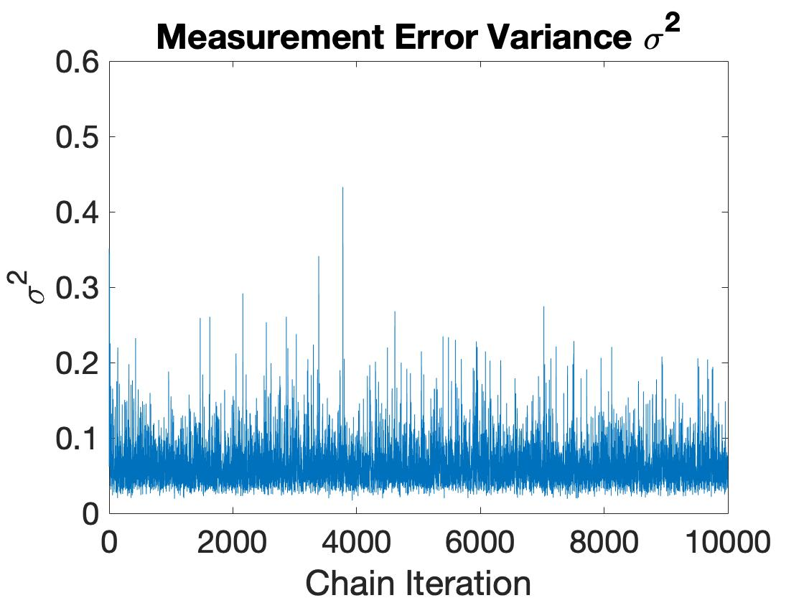

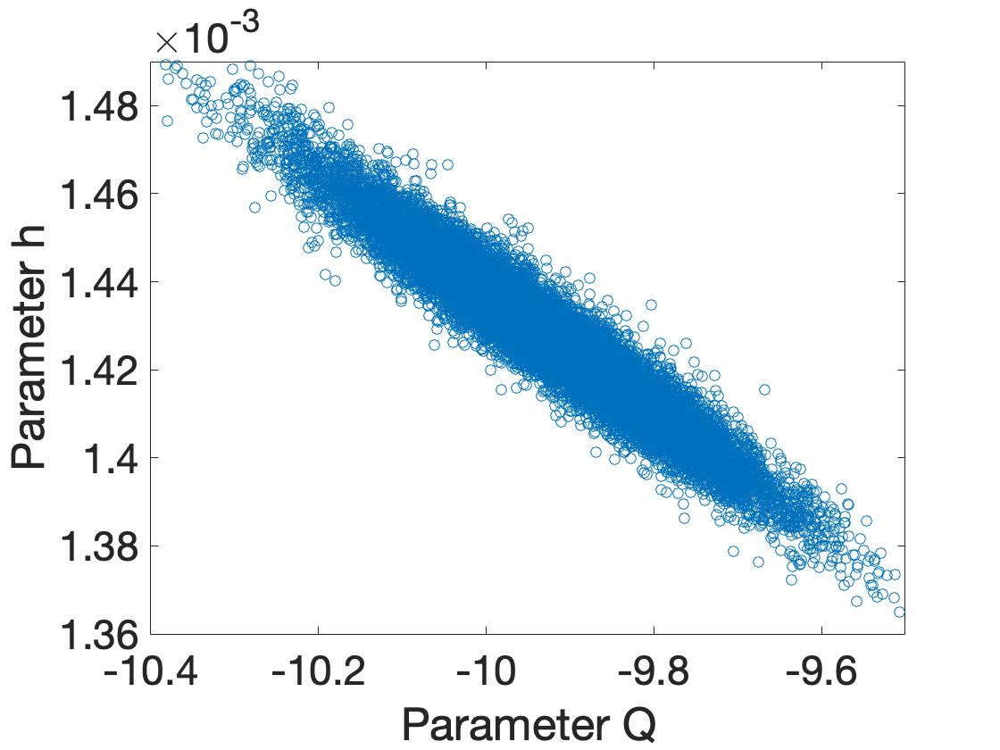

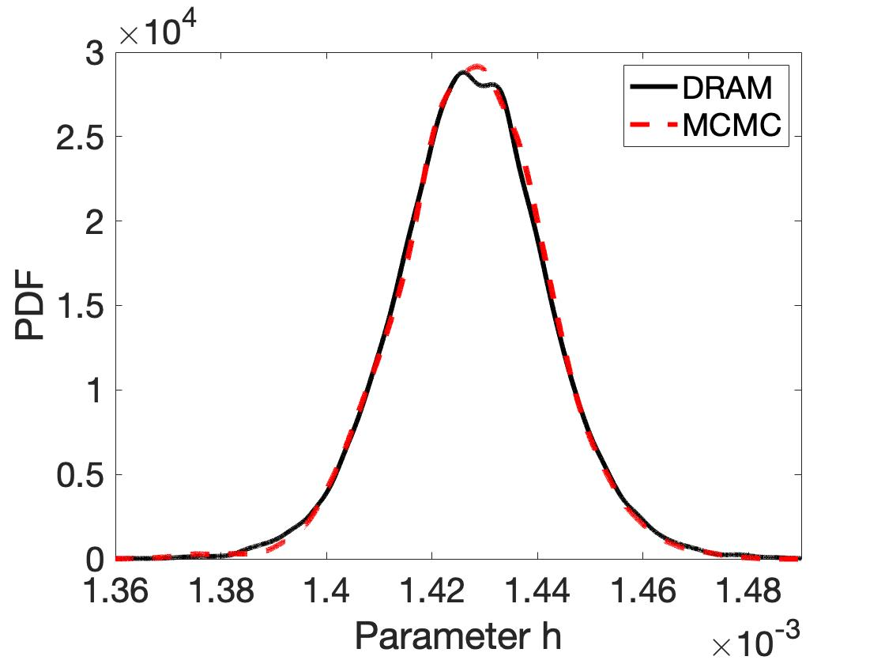

**Figure 1:** Chain plots and joint samples using DRAM and Metropolis Algorithm.

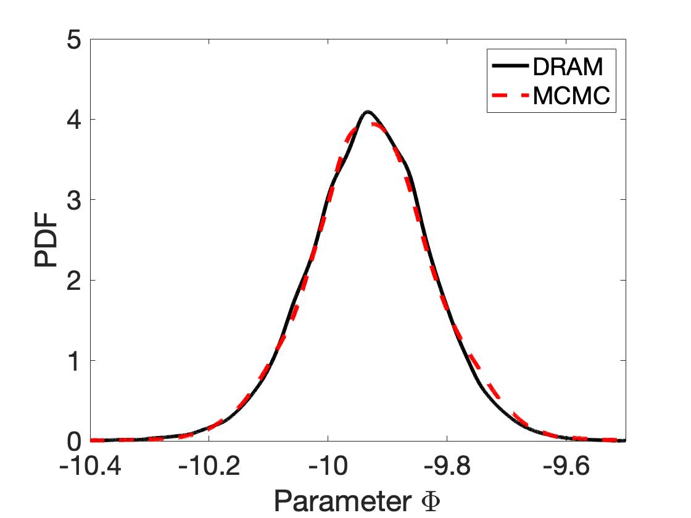

**Figure 2:** Marginal posterior distributions comparing DRAM and MCMC.

---

## Problem 2: SIR Model Bayesian Inference

### Problem Statement

Consider the SIR model:

$$\frac{dS}{dt} = \delta N - \delta S - \gamma IS, \quad S(0) = 900$$

$$\frac{dI}{dt} = \gamma IS - (r + \delta)I, \quad I(0) = 100$$

$$\frac{dR}{dt} = rI - \delta R, \quad R(0) = 0$$

where $\gamma, r, \delta \in [0, 1]$.

### Part (a): Three-Parameter Model

The OLS estimated parameters are used as initial values for DRAM:

$$\gamma = 0.0100, \quad \delta = 0.1953, \quad r = 0.7970$$

Initial covariance matrix:

$$V = \begin{bmatrix} 1.7357 \times 10^{-8} & 1.8575 \times 10^{-7} & 1.4540 \times 10^{-7} \\ 1.8575 \times 10^{-7} & 2.6153 \times 10^{-5} & 3.1790 \times 10^{-5} \\ 1.4540 \times 10^{-7} & 3.1790 \times 10^{-5} & 8.4797 \times 10^{-5} \end{bmatrix}$$

**Estimated observational standard deviation:** $\sigma = 21.0528$ (Bayesian) vs $\sigma = 20.6586$ (OLS)

**Chain covariance matrix:**

$$V = \begin{bmatrix} 4.9214 \times 10^{-8} & 8.2561 \times 10^{-8} & 1.3512 \times 10^{-7} \\ 8.2561 \times 10^{-8} & 1.0218 \times 10^{-4} & 1.1635 \times 10^{-4} \\ 1.3512 \times 10^{-7} & 1.1635 \times 10^{-4} & 2.1544 \times 10^{-4} \end{bmatrix}$$

**Bayesian parameter estimates:**

$$\gamma = 0.0100, \quad \delta = 0.1958, \quad r = 0.7979$$

These are close to the Frequentist estimates.

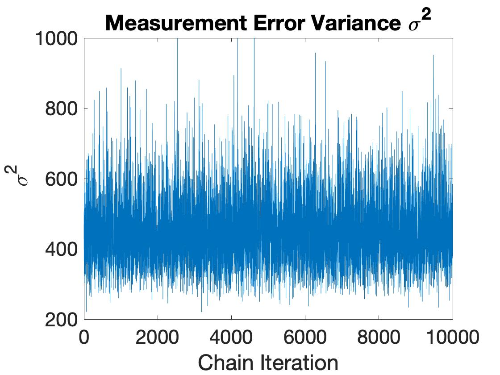

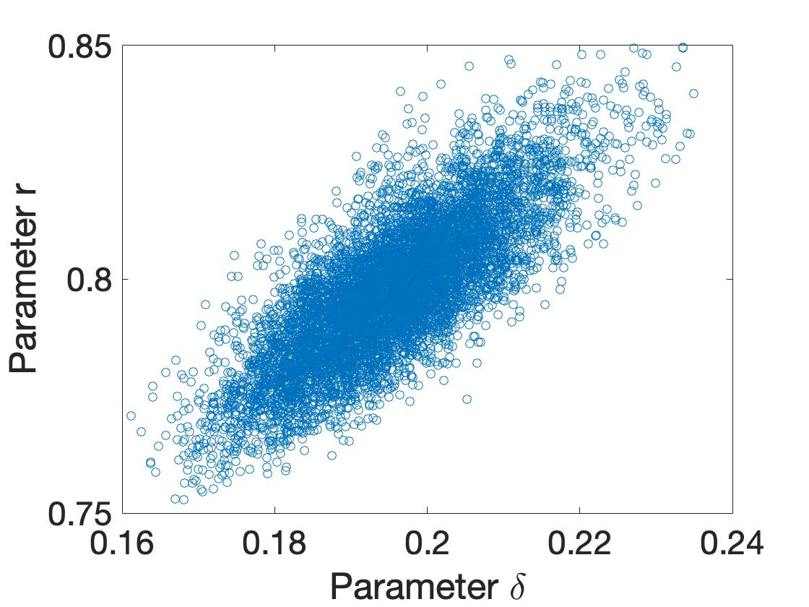

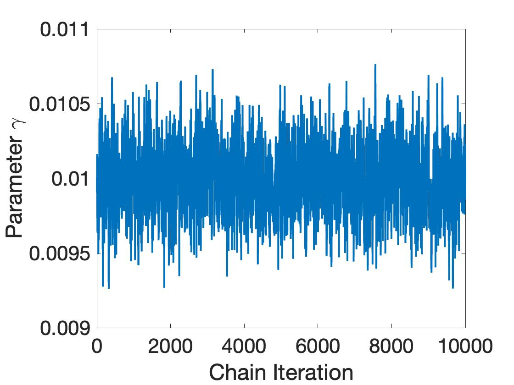

**Figure 3:** Chain plots, pairwise samples, and variance chain for SIR model.

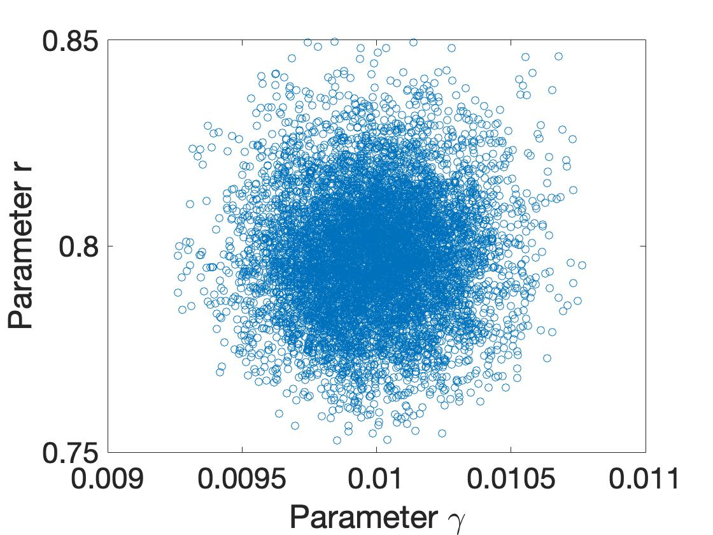

**Figure 4:** Marginal posterior distributions comparing DRAM and OLS.

### Part (b): Non-Identifiable Four-Parameter Model

Consider the model with parameters $\theta = [\gamma, r, \delta, k]$ where the model includes the product $\gamma k$:

$$\frac{dS}{dt} = \delta N - \delta S - \gamma k IS$$

Without specifying an initial covariance matrix, we obtain non-converged chains. The joint sample distribution shows that $\gamma \times k$ equals a constant, revealing the non-identifiability.

**Key Finding:** Bayesian analysis can identify mutually non-identifiable parameters through the pairwise posterior distributions.

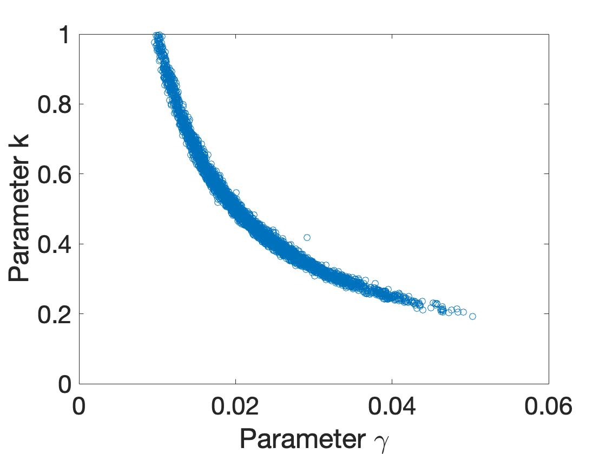

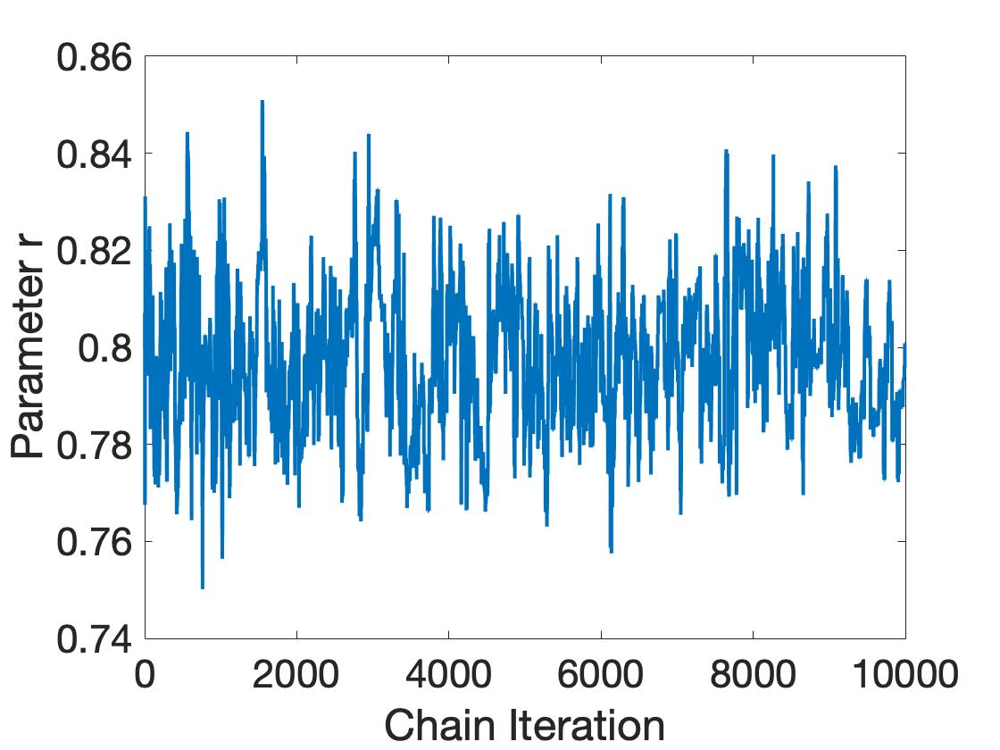

**Figure 5:** Non-converged chains and joint samples showing $\gamma$ and $k$ are not separately identifiable.

### Part (c): Influenza Outbreak Model

For the British boarding school data with $\delta = 0$, $S(0) = 760$, $I(0) = 3$, $R(0) = 0$, $N = 763$:

**OLS initial values:**

$$\gamma = 0.0022, \quad r = 0.4469$$

**Initial covariance matrix:**

$$V = \begin{bmatrix} 3.3117 \times 10^{-10} & 1.3030 \times 10^{-7} \\ 1.3030 \times 10^{-7} & 1.5355 \times 10^{-4} \end{bmatrix}$$

**Bayesian parameter estimates:**

$$\gamma = 0.0022, \quad r = 0.4487$$

**Observational variance comparison:**
- Bayesian: $\sigma = 19.6142$
- Frequentist: $\sigma = 18.0413$

**Chain covariance matrix:**

$$V = \begin{bmatrix} 1.9002 \times 10^{-9} & 2.3783 \times 10^{-7} \\ 2.3783 \times 10^{-7} & 2.8680 \times 10^{-4} \end{bmatrix}$$

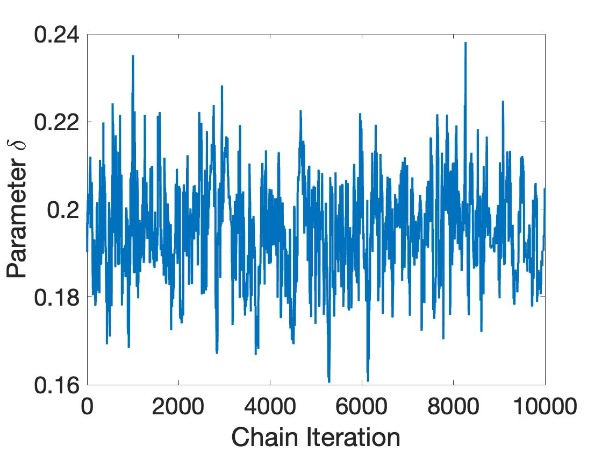

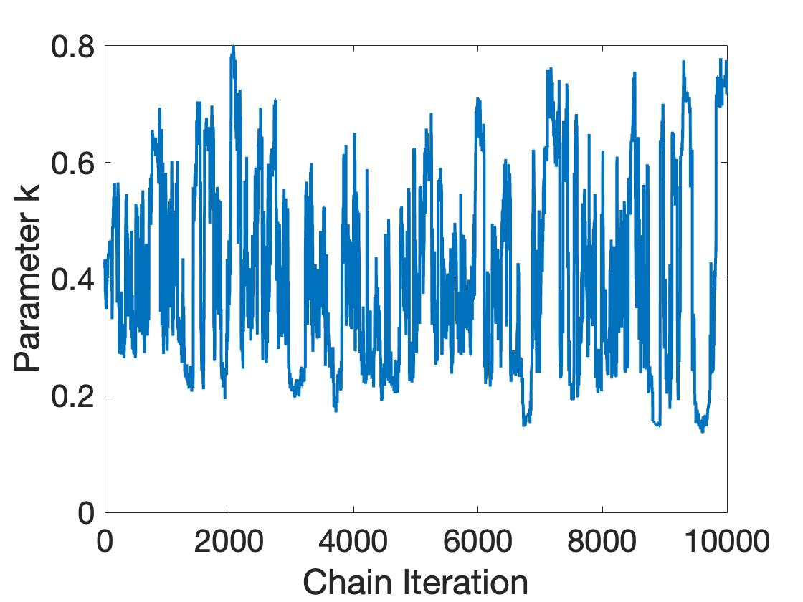

**Figure 6:** Chain plots and marginal distributions for influenza model.

---

## Problem 3: Helmholtz Energy Model MCMC

### Problem Statement

Consider the Helmholtz energy:

$$\psi(P, \theta) = \alpha_1 P^2 + \alpha_{11} P^4 + \alpha_{111} P^6$$

where $P$ is the polarization on $[0, 0.8]$ and $\theta = [\alpha_1, \alpha_{11}, \alpha_{111}]^\top$.

### OLS Estimation

Using `fminsearch.m` with the Helmholtz.txt data:

$$\alpha_1 = -382.99, \quad \alpha_{11} = 717.90, \quad \alpha_{111} = 145.27$$

With $n = 81$ data points and $p = 3$ parameters:

$$\sigma^2 = \frac{1}{n-p} \mathbf{R}^\top \mathbf{R} = 12.2068$$

**Covariance matrix:**

$$V = \begin{bmatrix} 120.01 & -582.35 & 649.33 \\ -582.35 & 3.08 & -3.61 \\ 649.33 & -3.61 & 4.38 \end{bmatrix}$$

### Part (a): DRAM Results

**Estimated parameters:**

$$\alpha_1 = -382.47, \quad \alpha_{11} = 715.6, \quad \alpha_{111} = 147.88$$

**Estimated observational variance:** $\sigma^2 = 13.4016$

**Chain covariance matrix:**

$$V = \begin{bmatrix} 111.70 & -532.36 & 588.08 \\ -532.36 & 2.81 & -3.29 \\ 588.08 & -3.29 & 4.01 \end{bmatrix}$$

### Part (b): Metropolis Algorithm Results

**Estimated parameters:**

$$\alpha_1 = -382.87, \quad \alpha_{11} = 716.99, \quad \alpha_{111} = 146.48$$

**Estimated observational variance:** $\sigma^2 = 13.4187$

### Comparison

Both algorithms converge and produce similar results. The marginal posterior distributions from DRAM and Metropolis are nearly identical. All results are close to OLS estimates.

The strong correlation between parameters (evident in pairwise plots) indicates why global sensitivity analysis techniques assuming parameter independence may give misleading results.

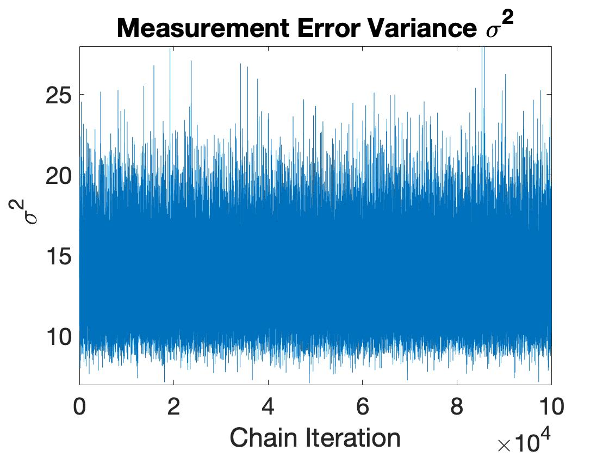

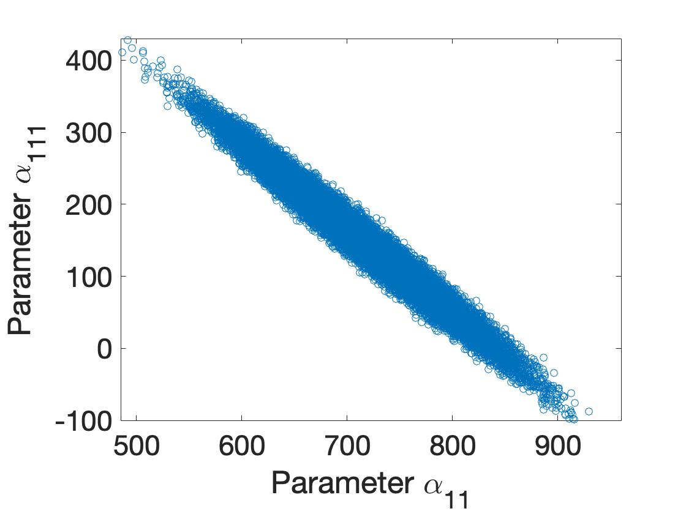

**Figure 7:** Chain plots and pairwise samples using DRAM.

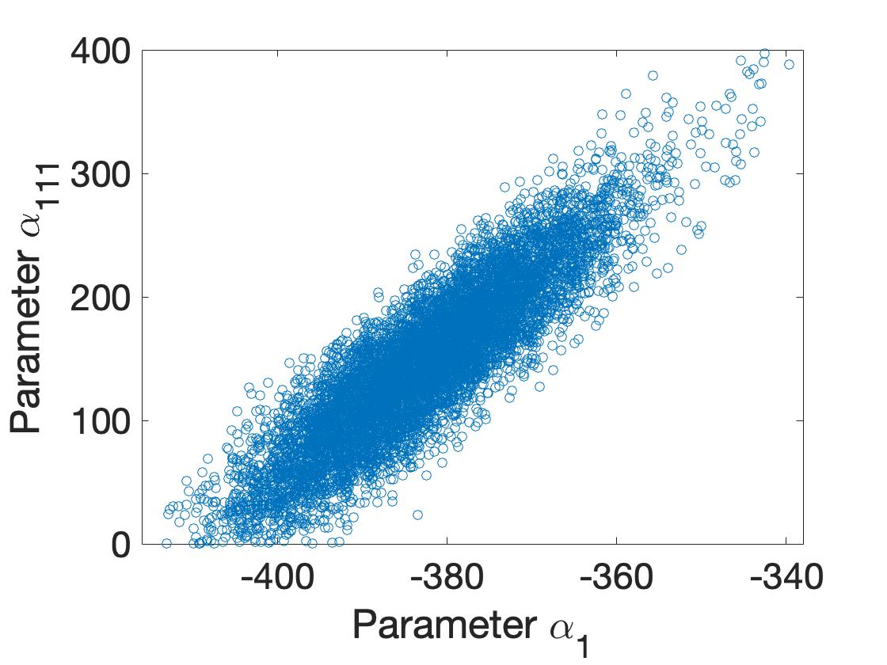

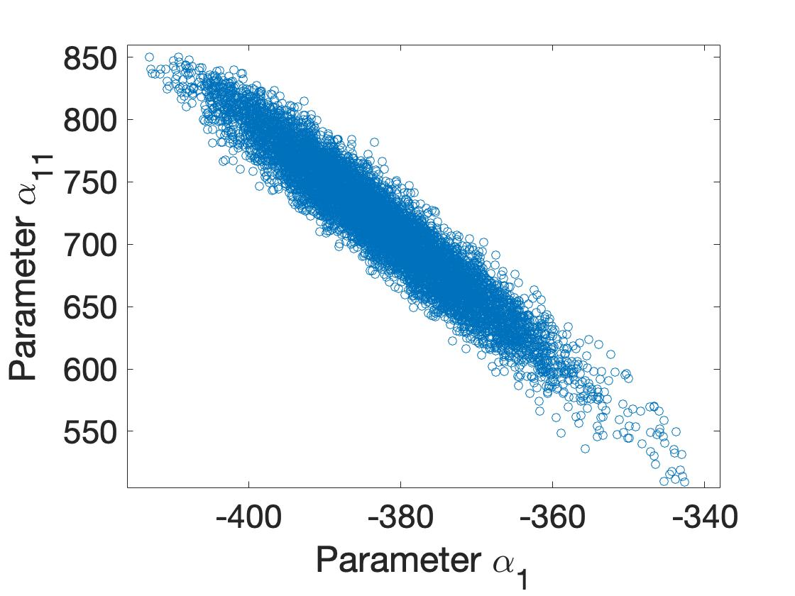

**Figure 8:** Chain plots and pairwise samples using Metropolis Algorithm.

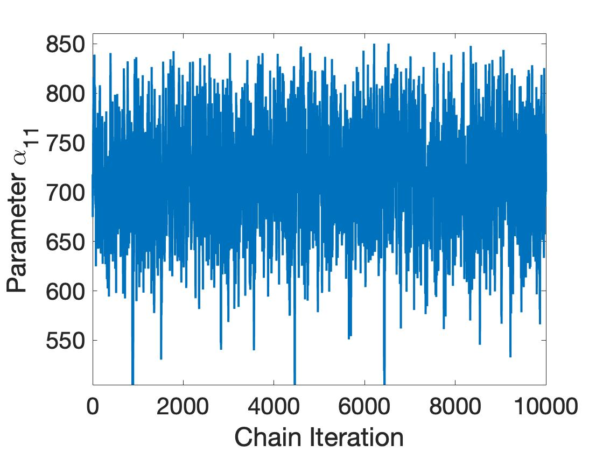

**Figure 9:** Marginal posterior distributions comparing DRAM and MCMC.

---

## Code Files

| File | Description |
|------|-------------|
| Problem1.m / Problem1.py | Heat model MCMC comparison |
| Problem2.m / Problem2.py | SIR model DRAM analysis |
| Problem3.m / Problem3.py | Helmholtz MCMC comparison |

## References

1. Haario, H. et al. (2006). DRAM: Efficient adaptive MCMC. *Statistics and Computing*.
2. Gelman, A. et al. (2013). *Bayesian Data Analysis*, 3rd Edition. CRC Press.
3. Smith, R.C. (2013). *Uncertainty Quantification*. SIAM.
