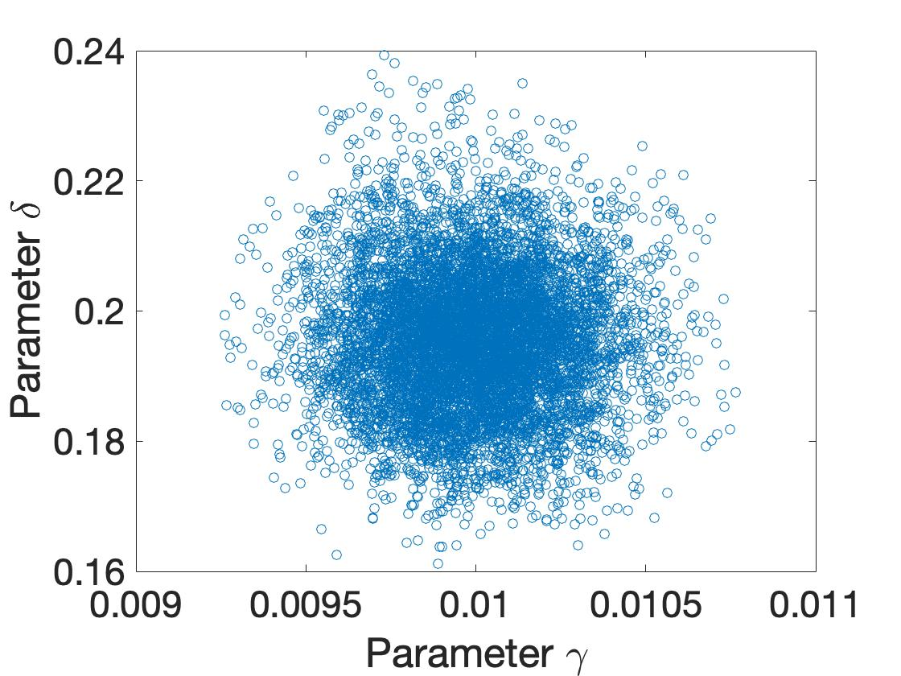

# Project 3: Bayesian Inference and MCMC

## Introduction

Bayesian inference provides a principled framework for combining prior knowledge with observed data to obtain posterior distributions for model parameters. Unlike point estimates from optimization, Bayesian methods quantify the full uncertainty in parameter values.

This project implements Markov Chain Monte Carlo (MCMC) algorithms to sample from posterior distributions and compares different sampling strategies.

## Bayesian Framework

### Bayes' Theorem

The posterior distribution is given by:

    p(theta | y) = p(y | theta) * p(theta) / p(y)

where:
- p(theta | y) is the posterior (what we want)
- p(y | theta) is the likelihood (data model)
- p(theta) is the prior (our beliefs before seeing data)
- p(y) is the evidence (normalizing constant)

### Likelihood for Regression

For data y with additive Gaussian noise:

    y = f(x; theta) + epsilon,  epsilon ~ N(0, sigma^2)

The likelihood is:

    p(y | theta, sigma^2) = (2*pi*sigma^2)^(-n/2) * exp(-RSS / (2*sigma^2))

where RSS is the residual sum of squares.

## Problem 1: Heat Equation Posterior Comparison

### Background

We revisit the heat conduction problem and compare:
- OLS estimates with normal approximation
- Full Bayesian posterior via MCMC

### MCMC Implementation

We implement two algorithms:

**Metropolis-Hastings**: Standard random walk sampler with fixed proposal covariance.

**Adaptive Metropolis**: The proposal covariance is updated based on the chain history to achieve better mixing.

### Algorithm: Metropolis-Hastings

```
1. Initialize theta_0
2. For i = 1 to N:
   a. Propose theta* ~ N(theta_{i-1}, C)
   b. Compute acceptance ratio:
      alpha = min(1, p(y|theta*)*p(theta*) / p(y|theta_{i-1})*p(theta_{i-1}))
   c. Accept with probability alpha:
      theta_i = theta* if u < alpha, else theta_i = theta_{i-1}
```

### Results

The chain traces show convergence after a burn-in period:


The posterior densities are compared with the normal approximation from OLS:


For well-behaved problems with sufficient data, the normal approximation is accurate. For small samples or complex posteriors, the full MCMC approach is necessary.

## Problem 2: SIR Model MCMC

### Background

We apply MCMC to the SIR epidemic model to obtain posterior distributions for infection parameters.

### DRAM Algorithm

The Delayed Rejection Adaptive Metropolis (DRAM) algorithm combines:
- Adaptive proposal updates for better mixing
- Delayed rejection to improve acceptance in difficult regions

### Results


The chains show good mixing after adaptation.


The pairwise scatter plots reveal correlations between parameters.


Comparison with OLS normal approximation:




## Problem 3: Helmholtz Model MCMC

### Background

We compare standard Metropolis-Hastings with DRAM for the Helmholtz energy model.

### Comparison of Algorithms

The standard Metropolis algorithm with fixed proposal may have poor acceptance rates if the proposal is not well-tuned. DRAM adapts automatically.

### Results

**DRAM Results:**


**Standard Metropolis Results:**


**Comparison:**


Both algorithms converge to the same posterior, but DRAM achieves better mixing with less tuning.

## Convergence Diagnostics

Proper MCMC requires checking for convergence:

1. **Visual inspection**: Chains should look like white noise after burn-in
2. **Acceptance rate**: Optimal around 23-44% for multivariate targets
3. **Autocorrelation**: Low autocorrelation indicates good mixing
4. **Effective sample size**: Should be large enough for reliable inference

## Summary

Key takeaways from this project:

1. MCMC provides full posterior distributions, not just point estimates.

2. The Metropolis-Hastings algorithm is simple but requires tuning the proposal.

3. Adaptive methods like DRAM automatically tune the proposal for better efficiency.

4. For simple problems with sufficient data, the normal approximation from OLS is often adequate.

5. Convergence diagnostics are essential to ensure reliable results.

## Code Files

| File | Description |
|------|-------------|
| Problem1.m / Problem1.py | Heat equation MCMC |
| Problem2.m / Problem2.py | SIR model DRAM |
| Problem3.m / Problem3.py | Helmholtz MCMC comparison |

## References

1. Haario, H. et al. (2006). DRAM: Efficient adaptive MCMC. Statistics and Computing.
2. Gelman, A. et al. (2013). Bayesian Data Analysis, 3rd Edition. CRC Press.
