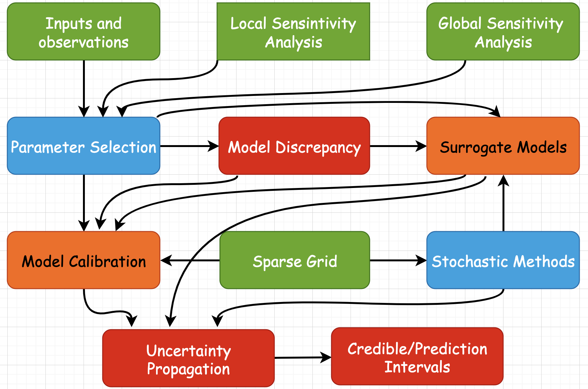

<p align="center">
  
</p>

<h1 align="center">Uncertainty Quantification</h1>

<p align="center">
  <strong>A comprehensive collection of projects covering computational methods for uncertainty quantification in mathematical models</strong>
</p>

<p align="center">
  
  
  
  
</p>

---

## Overview

This repository contains implementations in both **MATLAB** and **Python** covering fundamental and advanced topics in uncertainty quantification:

- Sensitivity analysis (local and global)
- Parameter estimation and identifiability
- Bayesian inference and MCMC methods
- Uncertainty propagation
- Surrogate modeling techniques
- Model discrepancy quantification

---

## Course Topics

| Topic | Description |
|-------|-------------|
| **Sensitivity Analysis** | Local (finite difference, complex-step) and global (Morris, Sobol) methods |
| **Parameter Estimation** | OLS, MLE, constrained optimization |
| **Bayesian Inference** | Prior specification, posterior computation, MCMC algorithms |
| **Uncertainty Propagation** | Confidence intervals, credible intervals, prediction intervals |
| **Surrogate Models** | Polynomial regression, Gaussian processes, sparse grids |
| **Model Discrepancy** | Quantifying differences between physical and computational models |

---

## Requirements

### MATLAB
- MATLAB R2021a or later
- [Optimization Toolbox](https://www.mathworks.com/products/optimization.html)
- [Global Optimization Toolbox](https://www.mathworks.com/products/global-optimization.html)
- [MCMC for MATLAB](https://mjlaine.github.io/mcmcstat/) (for Project 3)

### Python
```bash
pip install -r requirements.txt
```

Required packages: `numpy`, `scipy`, `matplotlib`, `statsmodels`

---

## Project 1: Sensitivity Analysis

**Topics:** Local and global sensitivity analysis, Fisher information matrix, parameter identifiability

| Problem | Description | MATLAB | Python |
|---------|-------------|--------|--------|
| 1 | Compute sensitivities of spring model | [UQ_8_5.m](Project%201/UQ_8_5.m) | [UQ_8_5.py](Project%201/UQ_8_5.py) |
| 2 | SIR model sensitivities and identifiability | [UQ_8_8.m](Project%201/UQ_8_8.m) | [UQ_8_8.py](Project%201/UQ_8_8.py) |
| 3 | Heat equation parameter identifiability | [UQ_8_9.m](Project%201/UQ_8_9.m) | [UQ_8_9.py](Project%201/UQ_8_9.py) |
| 4 | Global sensitivity (Morris, Sobol) for Helmholtz model | [UQ_9_6.m](Project%201/UQ_9_6.m) | [UQ_9_6.py](Project%201/UQ_9_6.py) |

[Project Writeup (PDF)](Project%201/Project_1_writeup.pdf)

---

## Project 2: Parameter Estimation

**Topics:** OLS estimation, constrained optimization, covariance estimation

| Problem | Description | MATLAB | Python |
|---------|-------------|--------|--------|
| 1 | Heat model parameter estimation (copper rod) | [Problem1.m](Project%202/Problem1.m) | [Problem1.py](Project%202/Problem1.py) |
| 2 | OLS for Helmholtz energy model | [Problem2.m](Project%202/Problem2.m) | [Problem2.py](Project%202/Problem2.py) |
| 3 | SIR model parameter distributions | [Problem3.m](Project%202/Problem3.m) | [Problem3.py](Project%202/Problem3.py) |

[Project Writeup (PDF)](Project%202/Project_2_writeup.pdf)

---

## Project 3: Bayesian Inference and MCMC

**Topics:** Metropolis-Hastings, DRAM, posterior distributions, convergence diagnostics

| Problem | Description | MATLAB | Python |
|---------|-------------|--------|--------|
| 1 | Posterior comparison for heat equation | [Problem1.m](Project%203/Problem1.m) | [Problem1.py](Project%203/Problem1.py) |
| 2 | Optimization vs Bayesian estimation | [Problem2.m](Project%203/Problem2.m) | - |
| 3 | MCMC for Helmholtz model | [Problem3.m](Project%203/Problem3.m) | - |

[Project Writeup (PDF)](Project%203/Project_3_writeup.pdf)

---

## Project 4: Uncertainty Propagation

**Topics:** Confidence intervals, credible intervals, prediction intervals

| Problem | Description | MATLAB | Python |
|---------|-------------|--------|--------|
| 1 | Frequentist intervals for height-weight model | [Problem1.m](Project%204/Problem1.m) | [Problem1.py](Project%204/Problem1.py) |
| 2 | Bayesian intervals for aluminum rod | [Problem2.m](Project%204/Problem2.m) | - |
| 3 | SIR model credible intervals | [Problem3a.m](Project%204/Problem3a.m) | - |
| 4 | Frequentist vs Bayesian comparison | [Problem4.m](Project%204/Problem4.m) | - |

[Project Writeup (PDF)](Project%204/Project_4_writeup.pdf)

---

## Project 5: Surrogate Models

**Topics:** Polynomial surrogates, Latin hypercube sampling, Gaussian processes

| Problem | Description | MATLAB | Python |
|---------|-------------|--------|--------|
| 1 | Polynomial surrogate with LHS | [Problem1.m](Project%205/Problem1.m) | [Problem1.py](Project%205/Problem1.py) |
| 2 | Legendre surrogate model | [Problem2.m](Project%205/Problem2.m) | - |
| 3 | Gaussian process regression | [Problem3.m](Project%205/Problem3.m) | [Problem3.py](Project%205/Problem3.py) |

[Project Writeup (PDF)](Project%205/Project_5_writeup.pdf)

---

## Project 6: Model Discrepancy

**Topics:** Physical vs surrogate model comparison, Dittus-Boelter equation

| Problem | Description | MATLAB | Python |
|---------|-------------|--------|--------|
| 1 | Dittus-Boelter equation analysis | [Final.m](Project%206/Final.m) | - |

[Project Writeup (PDF)](Project%206/Project_6_writeup.pdf)

---

## Key Concepts Implemented

### Sensitivity Analysis Methods
- **Finite Difference**: First-order approximation of derivatives
- **Complex-Step**: Machine-precision derivative approximation
- **Morris Screening**: Efficient global sensitivity screening
- **Sobol Indices**: Variance-based sensitivity measures

### MCMC Algorithms
- **Metropolis-Hastings**: Standard random-walk sampler
- **Adaptive Metropolis**: Self-tuning proposal distribution
- **DRAM**: Delayed Rejection Adaptive Metropolis

### Surrogate Modeling
- **Polynomial Regression**: Least squares fitting
- **Latin Hypercube Sampling**: Space-filling experimental design
- **Gaussian Process**: Non-parametric probabilistic model

---

## Getting Started

### MATLAB
```matlab
% Navigate to project folder
cd 'Project 1'
% Run a script
UQ_8_5
```

### Python
```bash
# Install dependencies
pip install -r requirements.txt

# Run a script
cd "Project 1"
python UQ_8_5.py
```

---

## Learning Outcomes

After studying these materials, you will be able to:

- Compute model sensitivities using analytical and numerical methods
- Identify estimable parameter subsets using Fisher information
- Perform global sensitivity analysis with Morris and Sobol methods
- Estimate parameters using frequentist and Bayesian approaches
- Implement MCMC algorithms for posterior sampling
- Construct confidence, credible, and prediction intervals
- Build surrogate models for computational efficiency
- Quantify model discrepancy and prediction uncertainty

---

## License

This project is licensed under the MIT License - see the [LICENSE](LICENSE) file for details.
